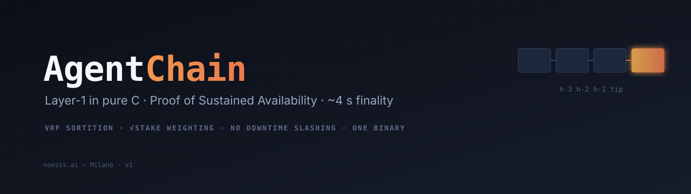

<div align="center">



**Agent-native Layer-1 blockchain — written in pure C, live on the public internet.**

[](LICENSE)
[](https://github.com/beltromatti/agentchain/actions/workflows/build.yml)
[](https://github.com/beltromatti/agentchain/releases)
[](PROTOCOL.md)
[](#mainnet-status)

[Protocol](PROTOCOL.md) · [Implementation notes](TECHNICAL-IMPLEMENTATION.md) · [Security audit](SECURITY-AUDIT.md) · [Releases](https://github.com/beltromatti/agentchain/releases)

</div>

---

## Why AgentChain exists

Two constituencies are poorly served by today's chains.

The first is anyone who would like to run a validator on a home computer, with a flaky residential connection, and not be punished for it. Existing proof-of-stake networks slash for downtime, optimise for datacenter-grade uptime, and concentrate voting weight in whichever entities can afford that uptime. The honest cost of decentralisation has been quietly priced out.

The second is the next generation of software — AI agents that act on behalf of people, settle commitments between themselves, and need a deterministic, low-friction venue to do so. The crypto rails we have today were built for humans clicking buttons, not for processes whose entire failure mode is unbounded retries against a busy mempool.

AgentChain is a single design that addresses both. It is a Layer-1 with:

- **A consensus tuned for participation, not capital.** Validator influence is `sqrt(stake)`, not `stake`. Doubling your bond does not double your vote. There is no slashing for going offline — only for cryptographically-provable double-signing.
- **A single-binary client under 1 MB.** Built in C11, depends only on `libsodium`, runs comfortably in 16 MB of RAM. Designed to sit on the same laptop someone is using for everything else.
- **A protocol that ships in one document.** [PROTOCOL.md](PROTOCOL.md) is the entire surface. There is no virtual machine in v1. There are no precompiles. Every byte on the wire is documented; every state transition fits on a page.

The native asset is **Credit (CRD)**. The smallest unit is the micro-Credit (`µCRD = 10⁻⁶ CRD`). All on-chain arithmetic is integer.

## Mainnet status

**AgentChain mainnet is live.**

- **`chain_id`** : `1`
- **Public bootstrap seed:** `34.61.207.49:30303` (Iowa, US — operated by Noesis AI)
- **Public read-only RPC:** `http://34.61.207.49:30304`
- **Genesis file** (canonical, bit-for-bit reproducible): [`deploy/mainnet-genesis.txt`](deploy/mainnet-genesis.txt)
- **Block time:** 2 s · **2-block finality:** ~4 s
- **Engine release:** [`v1.0.7`](https://github.com/beltromatti/agentchain/releases/tag/v1.0.7)

The first seed is operated by Noesis AI on a Google Cloud Always-Free `e2-micro` instance. We are honest about what this means: until other independent validators bond stake and bring up their own nodes, Noesis AI is the dominant operator. The protocol is designed to make that transition trivial — see [Run your own node](#run-your-own-node) below. The chain accepts new validators the moment they bond `STAKE_BOND`; no central coordination is required.

Live status from your terminal:

```sh
curl -s -X POST -H 'content-type: application/json' \
  -d '{"jsonrpc":"2.0","id":1,"method":"chain_info"}' \
  http://34.61.207.49:30304/
```

## Try it in 60 seconds

Download the pre-built binary for your OS — Linux x86_64/arm64, macOS x86_64/arm64, Windows x86_64 — from the [latest release](https://github.com/beltromatti/agentchain/releases/latest):

```sh
# macOS arm64 example
curl -L https://github.com/beltromatti/agentchain/releases/latest/download/agentchain-v1.0.7-macos-arm64.tar.gz | tar xz
cd agentchain-v1.0.7-*
./agentchain version
./agentchain info --rpc 34.61.207.49:30304
```

Send a transaction (you'll need a balance — see "Get test Credits" below):

```sh
./agentchain keygen --out my.key
./agentchain pubkey --key my.key                                   # your address
./agentchain send  --rpc 34.61.207.49:30304 \
                   --from-key my.key \
                   --to     <recipient_hex_pubkey> \
                   --amount 1000000 --tip 1
```

## Run your own node

A full node — or a validator — joins mainnet by pointing at the same genesis file and the same seed.

```sh
# 1) Get the binary (see above).
# 2) Pick a data directory. The first run generates a node key.
mkdir -p ~/agentchain-data

# 3) Run as a syncing node (read-only):
./agentchain node \
    --data-dir ~/agentchain-data \
    --genesis  deploy/mainnet-genesis.txt \
    --seeds    34.61.207.49:30303

# 4) Or run as a validator (adds --validator):
./agentchain node \
    --data-dir ~/agentchain-data \
    --genesis  deploy/mainnet-genesis.txt \
    --seeds    34.61.207.49:30303 \
    --validator
```

To actually produce blocks you need bonded stake (`≥ 100 CRD`). The path is:

1. Run the node to generate your `node.key` and get your address (`agentchain pubkey`).
2. Receive `CRD` from the founder allocation (`info@noesis.ai`) or any community member.
3. Submit `STAKE_BOND` with that address — you become eligible for sortition immediately.

The protocol is forgiving about uptime — being offline costs you potential block rewards but nothing else. Only cryptographically-provable double-signing is slashable. See [`PROTOCOL.md`](PROTOCOL.md) § 6.6.

## How the consensus works (in 60 seconds)

Every 2 seconds is a slot. In every slot:

1. Each validator privately computes a VRF over `(epoch_seed, slot_number)` using its private key. The VRF output tells the validator whether *it* is eligible to propose this slot, and whether *it* is in this slot's 64-member committee. The two roles are sampled independently.
2. Validators that are leader-eligible produce a block and broadcast it. Validators that are committee-eligible sign the block they see and broadcast their signature.
3. When more than two thirds of the committee's `sqrt(stake)` has signed the same block, every node accepts it. Two blocks later, it is irreversible.

The mechanism is a faithful synthesis of well-understood building blocks: VRF sortition (originally Algorand), square-root vote weighting (public-choice literature), single-round BFT commits, and EIP-1559 fee burning. No individual component is novel. The contribution is the combination, tuned for an audience that historical PoS designs have been quietly excluding.

The mechanism has a name: **Proof of Sustained Availability**. The full design is in [PROTOCOL.md](PROTOCOL.md).

## Build from source

```sh
sudo apt-get install -y cmake build-essential libsodium-dev   # Debian/Ubuntu
brew install cmake libsodium                                  # macOS

git clone https://github.com/beltromatti/agentchain
cd agentchain
cmake -S . -B build -DCMAKE_BUILD_TYPE=Release
cmake --build build -j
N=4 RUN_S=30 testnet/run.sh    # 4-node local testnet smoke
```

## CLI quick reference

```sh
agentchain node       --data-dir DIR [--genesis FILE] [--port 30303]
                       [--rpc-port 30304] [--seeds host:port,…] [--validator]

agentchain keygen     --out node.key
agentchain pubkey     --data-dir DIR
agentchain genesis    --chain-id N --out genesis.txt
                       --account HEX:BAL:STAKE [--account …]

agentchain send       --rpc URL --from-key node.key
                       --to HEX --amount UCRD [--tip N] [--memo TEXT]
agentchain stake      --rpc URL --from-key node.key --amount UCRD [--tip N]
agentchain unbond     --rpc URL --from-key node.key --amount UCRD [--tip N]
agentchain balance    --rpc URL --address HEX
agentchain info       --rpc URL
```

## Architecture, in one diagram

```
                       ┌──────────────────────┐
   slot tick (2s) ────▶│  consensus           │◀── tx ann / vote / block ann (gossip)
                       │  (PoSA orchestration)│
                       └─────────┬────────────┘
                                 │ proposes, votes
                                 ▼
   ┌──────────────┐       ┌──────────────┐       ┌──────────────┐
   │  mempool     │──tx──▶│   chain      │──blk─▶│   state      │
   │  (fee mkt)   │       │   (storage,  │       │   (accounts, │
   │              │       │    validate) │       │    names)    │
   └──────▲───────┘       └──────┬───────┘       └──────────────┘
          │                      │  state root
       tx │                      │
          │                      ▼
   ┌──────┴───────┐       ┌──────────────┐
   │  RPC (HTTP)  │       │  net (TCP)   │
   │  JSON-RPC    │       │  gossip      │
   └──────────────┘       └──────────────┘
```

All eleven files compile into a single binary. The whole codebase is under 6,000 lines of C, by design.

## Security

A first-party security audit by Noesis AI is published at [`SECURITY-AUDIT.md`](SECURITY-AUDIT.md). It enumerates the cryptographic primitives used, the protocol invariants enforced, the code-level hazards reviewed, every implementation finding with status, and the known open items. Every claim is annotated with its evidence — a libsodium audit, an IETF RFC, or a reproducible test in this repository.

If you find a vulnerability, please open a private security advisory on GitHub or reach out at [info@noesis.ai](mailto:info@noesis.ai).

## Where to go from here

- **[PROTOCOL.md](PROTOCOL.md)** — the normative specification.
- **[TECHNICAL-IMPLEMENTATION.md](TECHNICAL-IMPLEMENTATION.md)** — how the reference client realises the protocol, the threading model, the v1.0 deviations and their rationale.
- **[SECURITY-AUDIT.md](SECURITY-AUDIT.md)** — first-party audit, evidence-based.
- **[`deploy/`](deploy/)** — systemd unit, Dockerfile, mainnet-seeds list, the canonical mainnet-genesis file.

## Who is building this

**[Noesis AI](https://github.com/beltromatti)** — an open-source effort operating out of Milan, Italy. AgentChain is the first project under the Noesis AI umbrella. The protocol design and the reference client are by **[Mattia Beltrami](https://github.com/beltromatti)**, an undergraduate at Politecnico di Milano. The work is independent and unfunded; contributions are welcome.

Reach out: [info@noesis.ai](mailto:info@noesis.ai). Issues are the preferred channel for substantive discussion.

## License

Apache 2.0. See [LICENSE](LICENSE). No part of this repository is encumbered by patents, royalty agreements, or restrictive terms.

---

<div align="center">

*Honest decentralisation. Deterministic finality. One binary. Read the protocol — it fits on a coffee break.*

</div>
